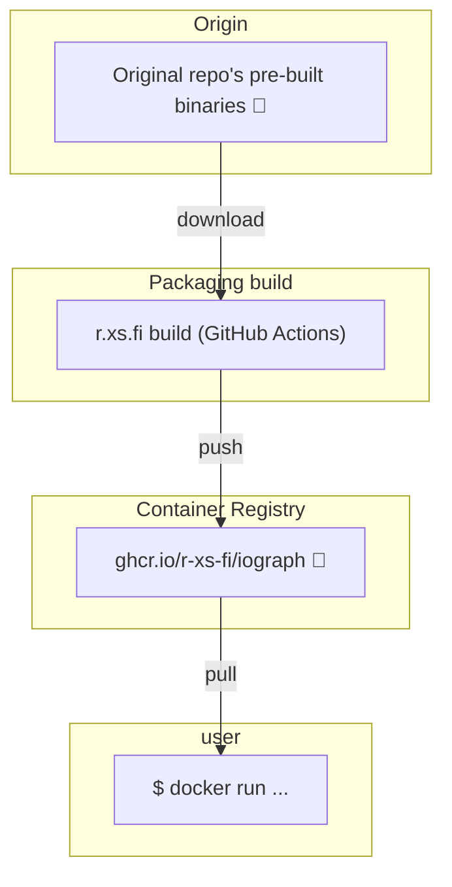

Container image for IOGraph - application that turns mouse movements into modern art.

## Usage

### Start

```shell
docker run --rm -it --env=DISPLAY --env=XAUTHORITY=/Xauthority --volume="$XAUTHORITY":/Xauthority --volume=/tmp/.X11-unix:/tmp/.X11-unix --volume=$(pwd):/workspace ghcr.io/r-xs-fi/iograph 
```

Outputs:
```console
MANIFEST READING
/usr/bin/IOGraph.jar
Jar manifest. 2
rsrc:META-INF/MANIFEST.MF
rsrc:META-INF/MANIFEST.MF
java.util.jar.Manifest@c828f095
Specification Version: 1.0.3
Aug 27, 2024 12:22:48 PM java.util.prefs.FileSystemPreferences$1 run
INFO: Created user preferences directory.
```

## Supported platforms


| OS    | Architecture  | Supported | Example hardware |
|-------|---------------|-----------|-------------|
| Linux | amd64 | ✅       | Regular PCs (also known as x64-64) |
| Linux | arm64 | ❌ (Prebuilt image not available.)       | Raspberry Pi with 64-bit OS, other single-board computers, Apple M1 etc. |
| Linux | arm/v7 | ❌ (Prebuilt image not available.)       | Raspberry Pi with 32-bit OS, older phones |
| Linux | riscv64 | ❌ (Prebuilt image not available.)       | More exotic hardware |

## How does this software get to me?


